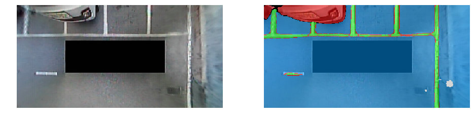

# Semantic segmentation for Around View Monitoring System

## Introduction

This is an implementation of the semantic segmentation algorithm for around view monitoring system in my paper ([*Semantic segmentation-based parking space detection with standalone around view monitoring system*](https://link.springer.com/article/10.1007%2Fs00138-018-0986-z)). This repository provides runnable codes with the trained model.

## Test environment

* opencv 3.3.1
* numpy 1.15.2
* matplotlib 2.2.3
* tensorflow 1.5.0 (GPU is preferable)

## Model download

* You can download the trained model using this [link](https://drive.google.com/open?id=1ragwEW1fRzpPU9BF42ActYfnOxpZcp06), and then you should move the model file to *./models* folder

## Inference result

